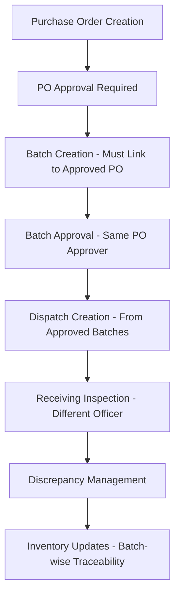

# GrainFlow - Comprehensive Grain Management System

<div align="center">
  
  
  
  
</div>

## 🌾 Overview

**GrainFlow** is a comprehensive, enterprise-grade grain management system designed for agricultural businesses, grain traders, and warehouse operations. Built with modern web technologies, it provides complete traceability from purchase orders to inventory management with strict workflow enforcement and segregation of duties.

### ✨ Key Features

- **🔐 Role-Based Access Control** - 3-tier permission system (Admin, Warehouse Staff, Standard User)
- **📋 Purchase Order Management** - Complete approval workflow with status tracking
- **📦 Batch Lifecycle Management** - From creation to delivery with full audit trail
- **🚛 Dispatch Management** - Multi-dispatch support with inspection workflow
- **👥 Supplier Management** - Comprehensive supplier profiles with performance analytics
- **📊 Real-Time Inventory** - Live stock tracking with automatic adjustments
- **🔔 Smart Notifications** - Real-time alerts with AJAX polling
- **📈 Advanced Reporting** - 6 report categories with PDF/Excel export
- **⚙️ System Administration** - Complete settings panel with admin utilities

## 🏗️ System Architecture

### Core Workflow



### Technology Stack

- **Backend**: CodeIgniter 4.6.2 (PHP 8.1+)
- **Database**: MySQL 8.0+ with comprehensive migrations
- **Frontend**: Bootstrap 5.3 with responsive design
- **Charts**: Chart.js for data visualization
- **Export**: PhpSpreadsheet (Excel) + TCPDF (PDF)
- **Icons**: Boxicons + FontAwesome
- **Authentication**: Session-based with role middleware

## 📋 Modules Overview

### 1. 🔐 Authentication & Role Management
- **3-Tier Role System**: Admin, Warehouse Staff, Standard User
- **Granular Permissions**: Module-level access control
- **User Management**: Complete CRUD with role assignment
- **Session Security**: Timeout and validation

### 2. 📄 Purchase Order Management
- **Approval Workflow**: Pending → Approved → Completed
- **Supplier Integration**: Dynamic supplier selection
- **Fulfillment Tracking**: Multi-batch delivery support
- **Financial Tracking**: Total amounts with currency formatting (TZS)

### 3. 📦 Batch Management
- **PO Linkage**: Mandatory connection to approved purchase orders
- **Bag-Level Tracking**: Individual bag weights and moisture content
- **Quality Control**: Grade assignment and quality metrics
- **Approval Process**: Same-user approval as PO for consistency
- **Status Tracking**: Pending → Approved → Dispatched → Delivered

### 4. 🚛 Dispatch Management
- **Multi-Dispatch Support**: Large orders split across multiple trucks
- **Driver Management**: Phone validation (Tanzanian format: +255xxxxxxxxx)
- **Status Updates**: Created → In Transit → Arrived → Inspected
- **Receiving Inspection**: Segregation of duties enforcement
- **Discrepancy Logging**: Automatic detection with tolerance thresholds

### 5. 👥 Supplier Management
- **Complete CRUD**: Create, Read, Update, Archive/Restore
- **Supplier Types**: Grain Vendor, Transporter, Service Provider, Equipment Supplier
- **Performance Analytics**: Financial summaries and activity tracking
- **Integration**: Dynamic dropdowns in batch and PO creation
- **Export Capabilities**: CSV export for data sharing

### 6. 📊 Inventory Management
- **Real-Time Tracking**: Live stock levels by grain type
- **Batch-Wise Traceability**: Complete audit trail from PO to inventory
- **Adjustment Management**: Manual adjustments with reason tracking
- **Low Stock Alerts**: Configurable threshold notifications
- **Multi-Location Support**: Warehouse-based inventory tracking

### 7. 🔔 Notifications System
- **Real-Time Alerts**: AJAX polling every 30 seconds
- **Event-Driven**: Batch arrivals, dispatch updates, system alerts
- **User Preferences**: Configurable notification settings
- **Unread Counters**: Dynamic badge updates
- **Notification Types**: Critical, Warning, Info, Success

### 8. 📈 Reporting System
- **6 Report Categories**:
  - **Inventory Reports**: Stock Summary, Batch Analytics
  - **Financial Reports**: Expense Analysis, Revenue Tracking
  - **Operations Reports**: Dispatch Performance, Efficiency Metrics
  - **Supplier Reports**: Performance Analysis, Activity Summaries
  - **Batch Reports**: Lifecycle Tracking, Quality Metrics
  - **System Reports**: User Activity, Audit Trails

- **Export Formats**: PDF (professional layouts), Excel (data manipulation)
- **Role-Based Access**: Reports filtered by user permissions
- **Interactive Charts**: Chart.js visualizations
- **Date Range Filtering**: Flexible time period selection

### 9. ⚙️ Settings & Administration
- **System Configuration**: Company details, currency, timezone
- **Admin Utilities**: Cache management, database optimization, backups
- **Settings Import/Export**: JSON-based configuration backup
- **System Health Monitoring**: Real-time status dashboard
- **Log Management**: System logs with filtering and search

## 🚀 Installation & Setup

### Prerequisites

- **PHP**: 8.1 or higher
- **MySQL**: 8.0 or higher
- **Composer**: Latest version
- **Web Server**: Apache/Nginx with mod_rewrite

### Installation Steps

1. **Clone the Repository**
   ```bash
   git clone https://github.com/JezyBrains/Cogsflow.git
   cd Cogsflow
   ```

2. **Install Dependencies**
   ```bash
   composer install
   ```

3. **Environment Configuration**
   ```bash
   cp .env.example .env
   ```
   
   Update `.env` with your database credentials:
   ```env
   database.default.hostname = localhost
   database.default.database = your_database_name
   database.default.username = your_username
   database.default.password = your_password
   database.default.DBDriver = MySQLi
   ```

4. **Database Setup**
   ```bash
   php spark migrate
   php spark db:seed DatabaseSeeder
   ```

5. **Set Permissions**
   ```bash
   chmod -R 755 writable/
   chmod -R 755 public/
   ```

6. **Web Server Configuration**
   
   **Apache (.htaccess)**
   ```apache
   RewriteEngine On
   RewriteCond %{REQUEST_FILENAME} !-f
   RewriteCond %{REQUEST_FILENAME} !-d
   RewriteRule ^(.*)$ index.php/$1 [L]
   ```

### Default Login Credentials

- **Username**: `admin`
- **Email**: `admin@cogsflow.com`
- **Password**: `NipoAgro2025!`

## 🔧 Configuration

### System Settings

Access **Settings** → **System Configuration** to configure:

- **Company Information**: Name, contact details, address
- **System Preferences**: Currency (TZS), timezone, date formats
- **Business Rules**: Stock thresholds, notification preferences
- **Security Settings**: Session timeout, password requirements

### Role Configuration

**Admin users** can manage roles via **Roles & Permissions**:

1. **Admin Role**: Full system access, user management, settings
2. **Warehouse Staff**: Inventory, batches, dispatches, suppliers
3. **Standard User**: Limited read access, basic operations

## 📊 Usage Examples

### Creating a Complete Workflow

1. **Create Purchase Order**
   ```
   Suppliers → Purchase Orders → New PO
   - Select supplier, specify grain type and quantity
   - Submit for approval
   ```

2. **Approve Purchase Order**
   ```
   Purchase Orders → View PO → Approve
   - Review details and approve
   ```

3. **Create Batch**
   ```
   Batches → New Batch
   - Link to approved PO
   - Enter bag details and quality metrics
   - Submit for approval (same user as PO approver)
   ```

4. **Create Dispatch**
   ```
   Dispatches → New Dispatch
   - Select approved batch
   - Assign driver and vehicle
   - Set destination
   ```

5. **Receive & Inspect**
   ```
   Batch Receiving → Inspection
   - Different officer performs inspection
   - Compare expected vs actual quantities
   - Log any discrepancies
   - Update inventory automatically
   ```

## 🔍 API Endpoints

### Key AJAX Endpoints

- **Notifications**: `/notifications/recent` - Get recent notifications
- **Suppliers**: `/suppliers/search` - Dynamic supplier search
- **Purchase Orders**: `/purchase-orders/search` - PO search and selection
- **Batch History**: `/batch-receiving/batch-history/{id}` - Complete audit trail
- **System Health**: `/settings/system-info` - Real-time system status

## 🛡️ Security Features

- **Role-Based Access Control**: Granular permissions per module
- **CSRF Protection**: All forms protected against cross-site attacks
- **Input Validation**: Server-side validation with sanitization
- **Session Security**: Timeout and regeneration
- **Audit Trail**: Complete change tracking with IP logging
- **Segregation of Duties**: Different users for creation vs inspection
- **Sensitive Data Masking**: Hidden fields in exports and logs

## 📈 Performance Features

- **Database Indexing**: Optimized queries with proper indexes
- **AJAX Pagination**: Efficient data loading
- **Debounced Search**: Reduced server requests
- **Caching System**: Settings and frequently accessed data
- **Optimized Assets**: Minified CSS/JS with local fonts

## 🔄 Backup & Maintenance

### Automated Backups
```bash
# Database backup
php spark backup:database

# Full system backup
php spark backup:full
```

### Maintenance Tasks
- **Clear Cache**: Settings → Admin Tools → Clear Cache
- **Database Optimization**: Settings → Admin Tools → Optimize Database
- **Log Cleanup**: Settings → Admin Tools → Clean Old Logs

## 🤝 Contributing

1. Fork the repository
2. Create a feature branch (`git checkout -b feature/amazing-feature`)
3. Commit your changes (`git commit -m 'Add amazing feature'`)
4. Push to the branch (`git push origin feature/amazing-feature`)
5. Open a Pull Request

## 📝 License

This project is licensed under the MIT License - see the [LICENSE](LICENSE) file for details.

## 🆘 Support

For support and questions:

- **Documentation**: Check the `/docs` folder for detailed module documentation
- **Issues**: Create an issue on GitHub
- **Email**: admin@cogsflow.com

## 🏆 Acknowledgments

- Built with [CodeIgniter 4](https://codeigniter.com/)
- UI components from [Bootstrap 5](https://getbootstrap.com/)
- Icons by [Boxicons](https://boxicons.com/) and [FontAwesome](https://fontawesome.com/)
- Charts powered by [Chart.js](https://www.chartjs.org/)

---

<div align="center">
  <strong>GrainFlow - Streamlining Grain Management Operations</strong><br>
  Made with ❤️ for the agricultural industry
</div>
